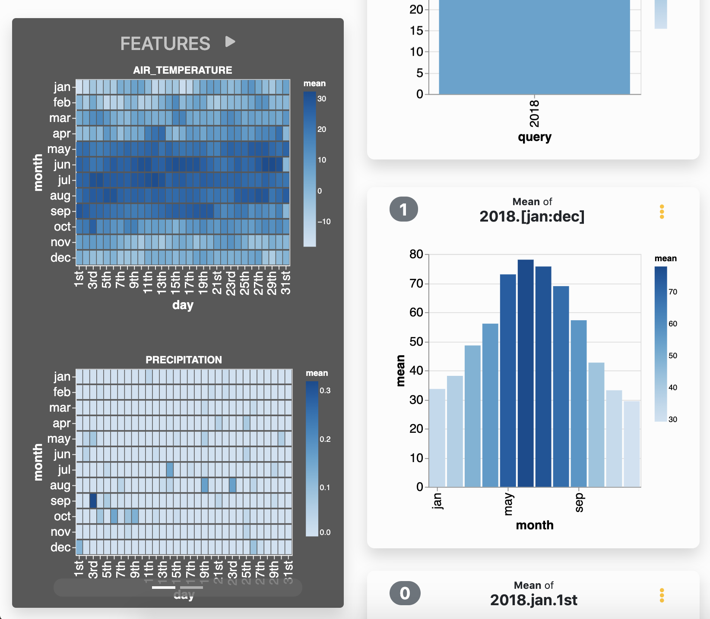

# Projects

The following projects are under active development.

## Agami: Scalable Streaming Visualization

(Collaboration with the USF [VGL](https://vgl.cs.usfca.edu))

Agami provides live-updating, interactive visualizations over
streaming data. We leverage in-memory data sketches to summarize and aggregate information
to be visualized, and also allow users to query future feature values by leveraging online
machine learning models. Our approach facilitates low-latency, iterative exploration of data
streams and can scale out incrementally to handle increasing stream velocities and query
loads.

[Visit the Github Organization](https://github.com/agami-viz) for more information about the project.

**Publications**: Lu et al. *Agami: Scalable Visual Analytics over Multidimensional Data Streams*. Proceedings of the 7th IEEE/ACM International Conference on Big Data Computing, Applications and Technologies (BDCAT) 2020.

## Archived Projects

