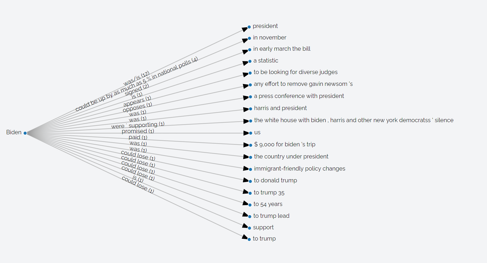

# Projects

The following projects are under active development.

## Agami: Scalable Streaming Visualization

(Collaboration with the USF [VGL](https://vgl.cs.usfca.edu))

Agami provides live-updating, interactive visualizations over
streaming data. We leverage in-memory data sketches to summarize and aggregate information
to be visualized, and also allow users to query future feature values by leveraging online
machine learning models. Our approach facilitates low-latency, iterative exploration of data
streams and can scale out incrementally to handle increasing stream velocities and query
loads.

[Visit the Github Organization](https://github.com/agami-viz) for more information about the project.

**Publications**: Lu et al. *Agami: Scalable Visual Analytics over Multidimensional Data Streams*. Proceedings of the 7th IEEE/ACM International Conference on Big Data Computing, Applications and Technologies (BDCAT) 2020.

## Quantum Criticism

Conceived by [Ted Gioia](https://theodoregioia.com/), Quantum Criticism is an umbrella of projects around news data and analysis. This includes sub-projects:

* Core QC -- collecting the text of digital print articles from various news sources, including the Atlantic, the BBC, Breitbart News, Fox News, NY Times, Reuters, Slate Magazine and others. These articles are analysed for sentiment on an article level, paragaraph level and sentence level.
* News KG -- a searchable knowledge graph of news articles in the QC database
* Perspective -- a project to determine the various perspectives (eg. political or demographic interests) of a news story as reported in different sources.

**Publications**:

* Badgujar et al. [Quantum Criticism: A Tagged News Corpus Analysed for Sentiment and Named Entities](https://arxiv.org/pdf/2006.05267.pdf). International Conference on Natural Language Computing Advances (NLCA) 2020.
* Badgujar et al. [QUANTUM CRITICISM: AN ANALYSIS OF POLITICAL NEWS REPORTING](https://www.academia.edu/download/63879929/7220mlaij0120200710-26340-vo1hwc.pdf). Machine Learning and Applications: An International Journal (MLAIJ) Vol 7, No. 1/2, June 2020.
* Matson et al. Visualising the News. IEEE VIS Workshop 2021.

## Archived Projects

The following projects are no longer under active development, but have open source releases and are often are used as the basis for future work.

* [Scalable NIO](https://github.com/USF-MAGICS/scalable-nio) - high-performance, non-blocking server for scalable communications. Project lead: Chirag Jain.

